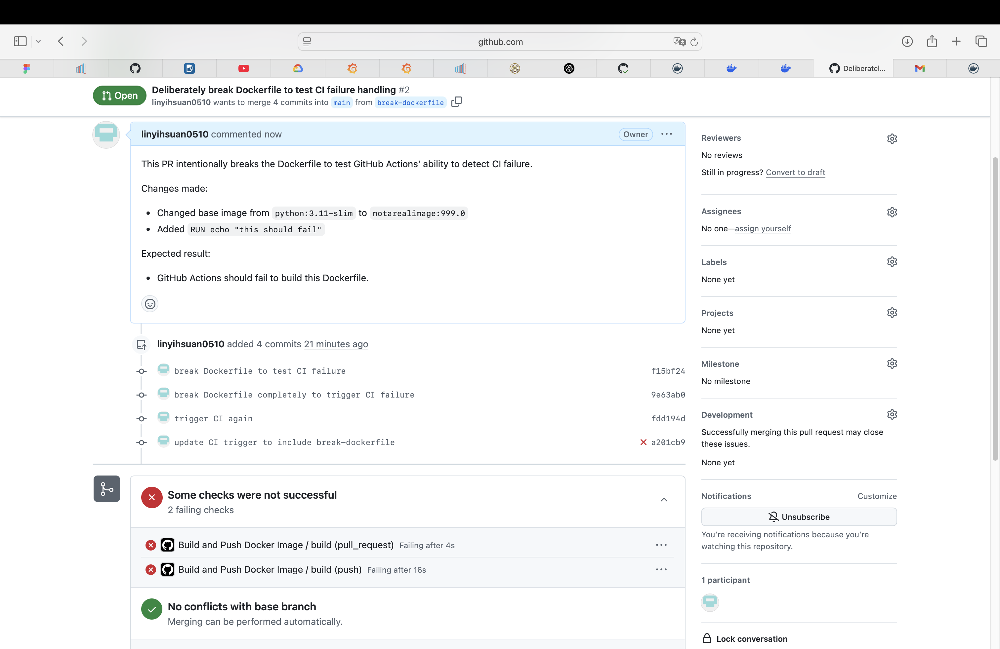

# 🐳 2025cloud — Containerized Flask App

本專案示範如何使用 Docker 將簡單的 Flask 應用程式容器化，並整合 GitHub Actions 實現 CI/CD，自動將 Image 推送至 Docker Hub 的 public repo。

---

## 🚧 專案架構簡介

* `app.py`：Flask 主程式
* `templates/`：Flask 的 HTML 頁面
* `Dockerfile`：定義如何建構此專案的 Container Image
* `.github/workflows/docker.yml`：GitHub Action 自動化流程設定
* `requirements.txt`：Python 套件安裝清單

---

## 🛠️ 如何使用 `docker build` 打包應用程式

請在專案根目錄執行以下指令：

```
docker build -t linyihsuan10/2025cloud:v1 .
```

說明：

* `-t` 表示標記產出的 Image 名稱與 tag
* `.` 代表 Dockerfile 位於目前目錄

---

## ▶️ 如何使用 `docker run` 執行此 Image

```
docker run -p 8888:8888 linyihsuan10/2025cloud:v1
```

說明：

* 將本機的 `8888` port 對應到容器內的 `8888`，即可透過 `http://localhost:8888` 存取應用程式
* 可改成你想要的 tag，如 `latest` 或其他版本

---

## ⚙️ GitHub Actions：CI/CD 自動化流程說明

### ✳️ 自動化流程觸發條件

當有任何 push 發生在 `main` 分支，或送出 Pull Request 時，GitHub Action 會自動執行。

### 🏗️ 自動化流程內容

1. 使用 GitHub Action 檢出程式碼
2. 使用 Docker 建立 Image（預設 Tag 為 `latest`）
3. 使用 Secret 中的帳密登入 Docker Hub
4. 自動將產生的 Image 上傳至：

   * `linyihsuan10/2025cloud:latest`
   * `linyihsuan10/2025cloud:v1`
  
### 🌀 自動化流程觸發與處理邏輯
每當有程式碼變動（如 push 到 main 或開 PR），GitHub Action 就會自動啟動。
Action 會執行以下流程：
1. 使用 Docker 建立新的 Image
2. 登入 Docker Hub（用 secret 登入）
3. 將 Image 推送到 Docker Hub 上的 2025cloud repo
4. 若 Dockerfile 有錯誤（例如拼錯 base image），GitHub Action 會自動偵測並停止流程。


   
### 🏷️ Image Tag 選擇邏輯
每次成功建立 Image 時：
都會被標記為 latest（最新版本）
也會標記為固定版本號，例如 v1、v2（可根據版本需求自訂）

### 🔐 憑證設定（Secrets）

請至 GitHub Repo → Settings → Secrets → Actions 中建立以下兩個變數：

* `DOCKER_USERNAME`：你的 Docker Hub 帳號（如 `linyihsuan10`）
* `DOCKER_PASSWORD`：你的 Docker Hub 密碼（或是 access token）

---

## 🧪 PR 測試錯誤範例（CI 應失敗）

本專案有建立一個分支 `break-dockerfile`，故意將 Dockerfile 改壞，例如：

```
# 正確版本：
FROM python:3.11-slim

# 改壞版本：
FROM pythonnnnnn:3.11-slim
```

並送出 Pull Request，以驗證 GitHub Actions 能正確偵測失敗。CI 執行後，會在 Actions 頁面中看到 build failed 的訊息。

PR 連結（範例）：
[https://github.com/linyihsuan0510/flask-container/pull/2](https://github.com/linyihsuan0510/flask-container/pull/2)

---

## 📦 Docker Hub Repo

* Repository 名稱：2025cloud
* Docker Hub 連結：[https://hub.docker.com/r/linyihsuan10/2025cloud](https://hub.docker.com/r/linyihsuan10/2025cloud)
* 擁有公開 tag：`latest`、`v1`（符合作業要求的兩個以上 Image）
